# Especificações do Projeto

A definição exata do problema e os pontos mais relevantes a serem tratados neste projeto foi consolidada com a participação dos usuários em um trabalho de imersão feita pelos membros da equipe a partir da observação dos usuários em seu local natural e por meio de entrevistas. Os detalhes levantados nesse processo foram consolidados na forma de personas e histórias de usuários. 

## Personas

As personas levantadas durante o processo de entendimento do problema são apresentadas na Figuras que se seguem. 

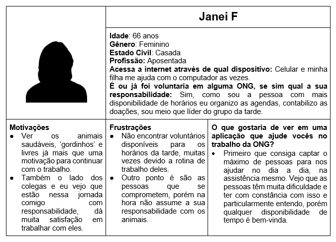

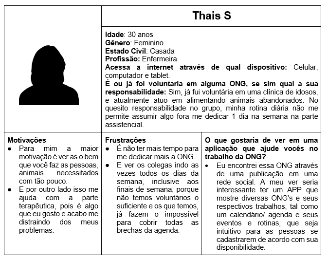

## Histórias de Usuários

A partir da compreensão do dia a dia das personas identificadas para o projeto, foram registradas as seguintes histórias de usuários. 

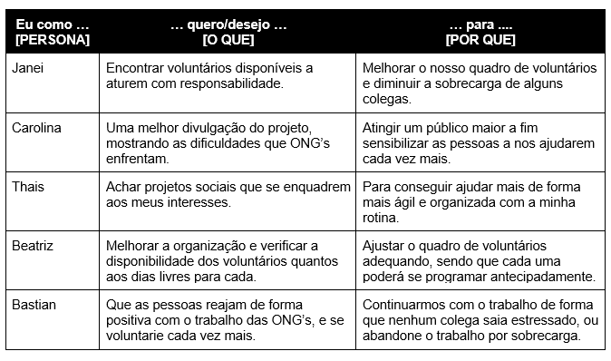

## Requisitos

O escopo funcional do projeto é definido por meio dos requisitos funcionais que descrevem as possibilidades interação dos usuários, bem como os requisitos não funcionais que descrevem os aspectos que o sistema deverá apresentar de maneira geral. Estes requisitos são apresentados a seguir. 

### Requisitos Funcionais

A tabela a seguir apresenta os requisitos do projeto, identificando a prioridade em que os mesmos devem ser entregues. 

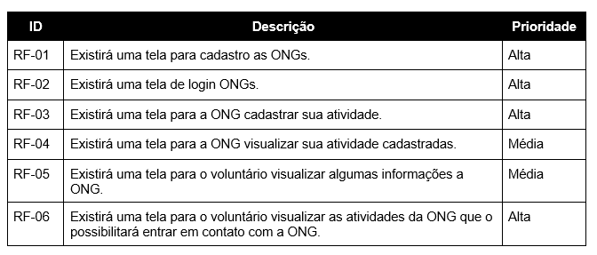

### Requisitos não Funcionais

A tabela a seguir apresenta os requisitos não funcionais que o projeto deverá atender. 

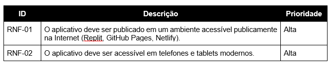

## Restrições

As questões que limitam a execução desse projeto e que se configuram como obrigações claras para o desenvolvimento do projeto em questão são apresentadas na tabela a seguir. 

## Matriz de rastreabilidade dos requisitos

A matriz de rastreabilidade dos requisitos serve para analisarmos as ligações do projeto, e com isso, avaliar e organizar as mudanças, gerenciando possíveis impactos. Por tanto, é essencial garantir o rastro entre os requisitos, os artefatos ligados aos requisitos, alinhando um ao outro, permitindo descobrir inconsistência no sistema, ajudando na gestão de riscos de forma rápida e simples. A tabela a seguir apresenta a matriz de rastreabilidade dos requisitos: 

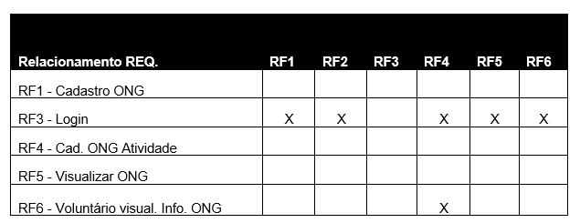

## Diagrama de Casos de Uso

O diagrama contempla as principais ligações previstas entre casos de uso e atores e permite detalhar os Requisitos Funcionais identificados na etapa anterior 

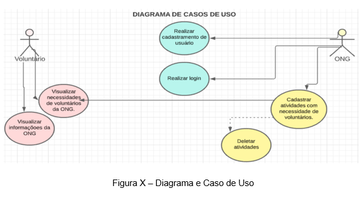

## Planejamento do cronograma 

Nessa parte, mostraremos processo envolvendo gestão financeira do Projeto. Planejamento do Gerenciamento de custo, Estimativa de custo, Determinação do Orçamento e Controle dos custos. A parte mais significativa é Recursos Humanos onde foi calculado o valor de horas estimadas do projeto multiplicado por 30 Reais a hora. Cobrado também o valor de 40% de Serviços onde inclui a despesa e o lucro do executor. 

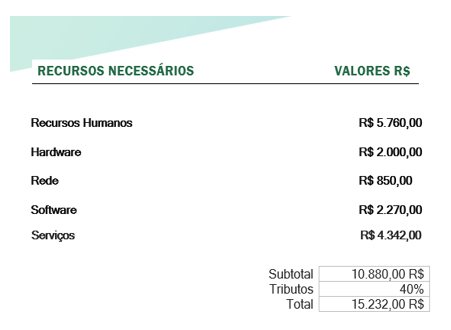
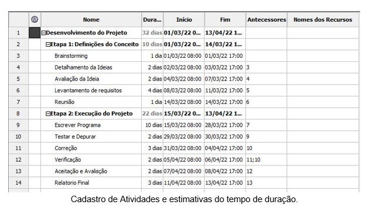
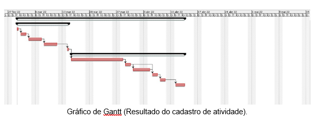

## Planejamento do cronograma 

A tabela mostra cinco indicadores de desempenho criados a partir de métricas simples, porém planejados a partir de metas e objetivos SMART´s para o presente projeto. Específicos, mensuráveis, atingíveis, relevantes e temporais.

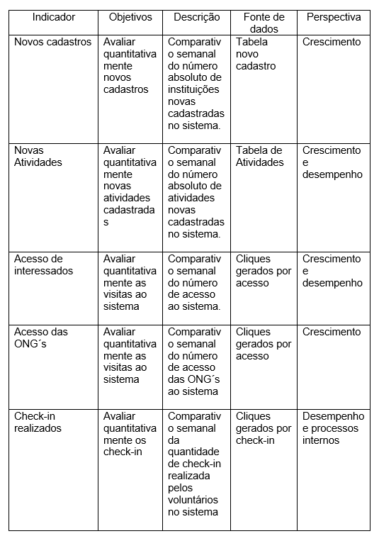

## Gráficos de Indicadores de Desempenho

As figuras a seguir mostram os gráficos que compreendem a tabela de indicadores de desempenho em um cenário hipotético.

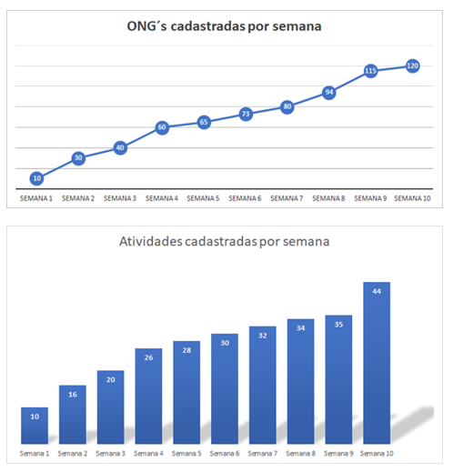
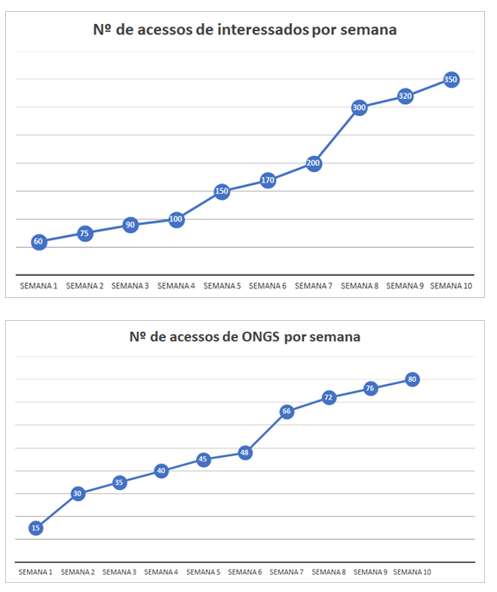

## Modelagem de Processos

A modelagem de processos permite de forma visual compreender melhor os processos de negócio de uma organização, seus principais objetivos são analisar, documentar e mapear esses processos, pode ter como meta a melhora da qualidade do produto, redução de custos, automação, entre outros. A metodologia utilizada na modelagem de processos foi a BPMN – Business Process Model and Notation.

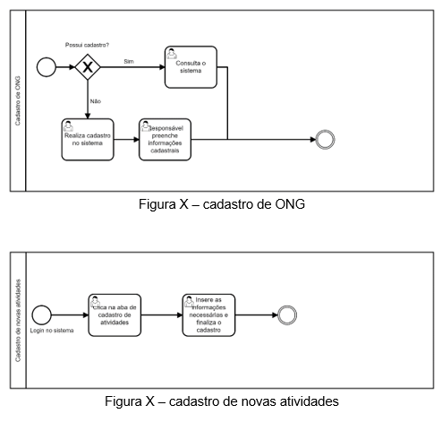
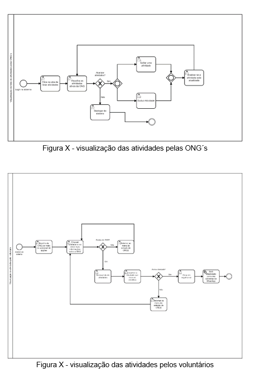