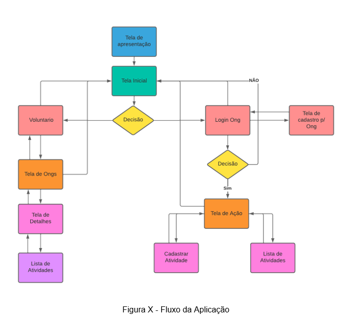
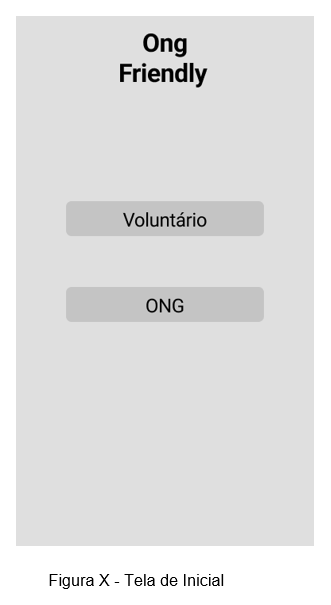
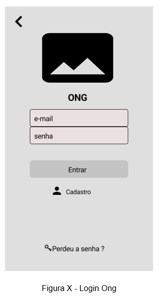
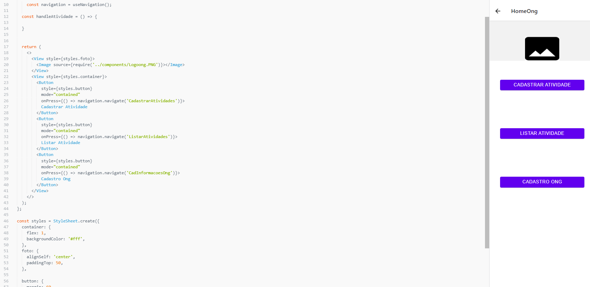
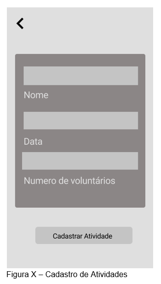
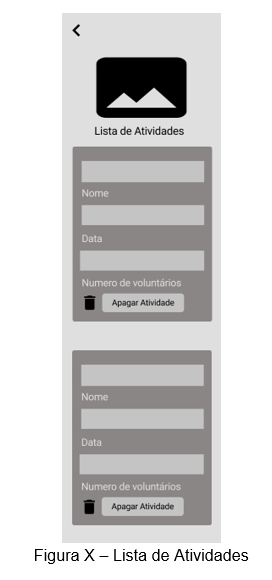
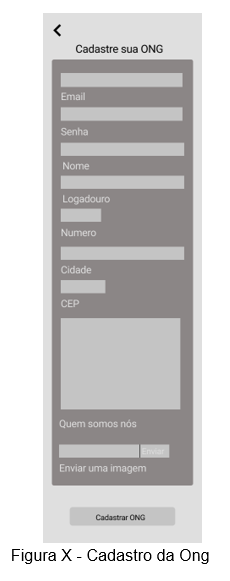
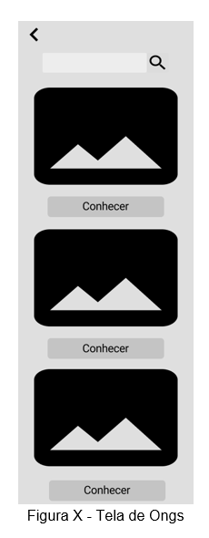
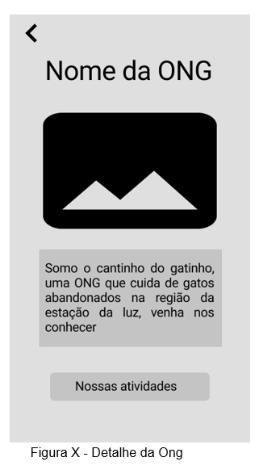
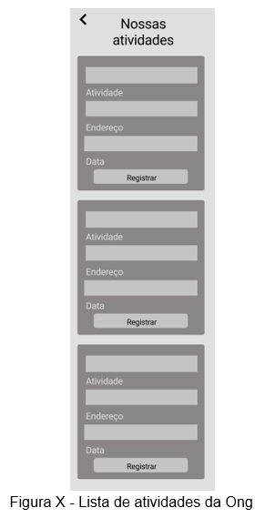

# Projeto de Interface

Dentre as preocupações para a montagem da interface do aplicativo, estabelecemos um foco em questões como simplificar a vida dos usuários e a familiaridade com outros aplicativos já existentes no mercado, sendo dinâmico, interativo e acessível. Desta forma, o projeto tem uma identidade visual moderna e com uma linguagem que “conversa” facilmente com os usuários, sendo o mesmo funcional em smartfones e tablets. 

## Diagrama de Fluxo

O diagrama apresentado na Figura X abaixo mostra o fluxo de interação do voluntário e da pelas telas aplicativo. Cada uma das telas deste fluxo é detalhada na seção de Wireframes que se segue. Para visualizar o aplicativo interativo, acesse o pelo link:(https://www.figma.com/proto/moNiEqYXwOHL2fPiI2mBOd/Wireframe-Ong-Friendly-New?node-id=1%3A99&scaling=scale-down&page-id=0%3A1&starting-point-node-id=1%3A7)

## Wireframes

Conforme fluxo de telas do projeto, apresentado no item anterior, as telas do aplicativo são apresentadas em detalhes nos itens que se seguem. Para visualizar o Wire frame interativo de alta fidelidade, acesse o link do figma (https://www.figma.com/proto/moNiEqYXwOHL2fPiI2mBOd/Wireframe-Ong-Friendly-New?node-id=1%3A99&scaling=scale-down&page-id=0%3A1&starting-point-node-id=1%3A7). O aplicativo segue um fluxo de via dupla, o usuário pode voltar ou seguir conforme suas necessidades 

## Tela – Splash Page  

A tela de apresentação do aplicativo, tela de carregamento para iniciar.	

## Tela – Inicial 

Esta tela apresenta o direcionamento, se o usuário é uma ong ou um voluntário. Sua função e direcionar corretamente a jornada de cada usuário. 

## Tela – Login Ong 

A tela de login da ONG tem como objetivo validar o usuário, possibilitando o mesmo também recuperar a senha e caso não tenha cadastro se cadastrar. Após login ela leva o usuário para a tela inicial da Ong. 

## Tela – Inicial da Ong 

Está tela permite ao usuário listar as atividades da ong e também cadastrar uma atividade. Conforme fluxograma o botão voltar irá retornar para a página anterior a esta. 

## Tela – Cadastro de Atividades 

Na tela cadastro de atividades o usuário tipo Ong poderá cadastrar uma atividade. Conforme fluxograma o botão voltar irá retornar para a página anterior a esta.

## Tela – Lista de Atividades 

Nesta tela lista de atividades o usuário terá a possibilidade de ver todas as atividades que foram criadas, podendo deletar quantas atividades quiser. Conforme fluxograma o botão voltar irá retornar para a página anterior a esta. 

## Tela – Cadastro da Ong 

Nesta tela o usuário informa dados sobre a ong para poder realizar o cadastro da mesma, após registrado o cadastro o usuário e direcionado para a tela inicial da Ong. Conforme fluxograma o botão voltar irá retornar para a página anterior a esta. 

## Tela – Tela de Ongs 

Nesta Tela de Ongs o usuário terá a possibilidade de visualizar uma lista de ong e poder conhecer mais sobre elas e possivelmente encontrar uma ong por nome. Conforme fluxograma o botão voltar irá retornar para a página anterior a esta. 

## Tela – Detalhes da Ong 

Nesta Tela de detalhes da Ong o usuário terá a possibilidade de conhecer mais sobre a ong com alguns detalhes e a sua lista de atividades. Conforme fluxograma o botão voltar irá retornar para a página anterior a esta. 

## Tela – Lista de atividades da Ong 

Nesta Tela de lista de atividades da Ong o usuário terá a possibilidade de visualizar as atividades das ongs e se registar em alguma atividade, não há restrição na quantidade de atividades que o usuário pode se registrar. Ao clicar em se registrar ele será direcionado para o aplicativo de WhatsApp, do qual poderá entrar em contato com a ONG. Conforme fluxograma o botão voltar irá retornar para a página anterior a esta. 

