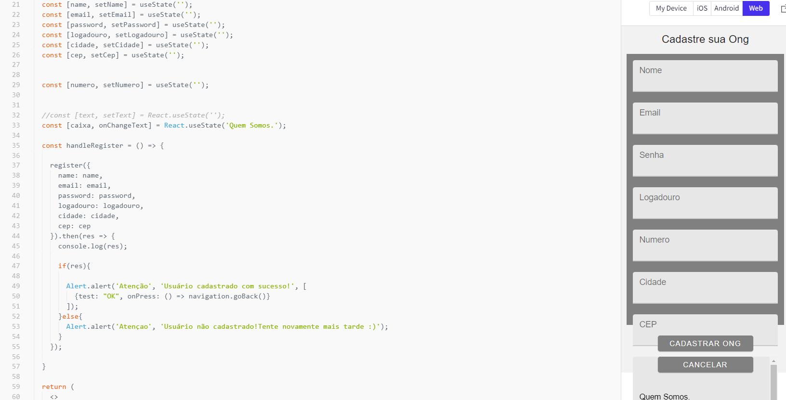
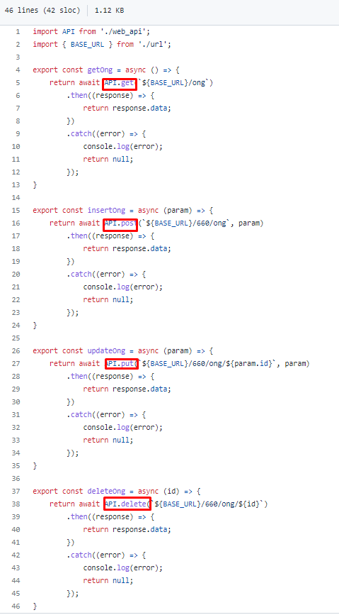
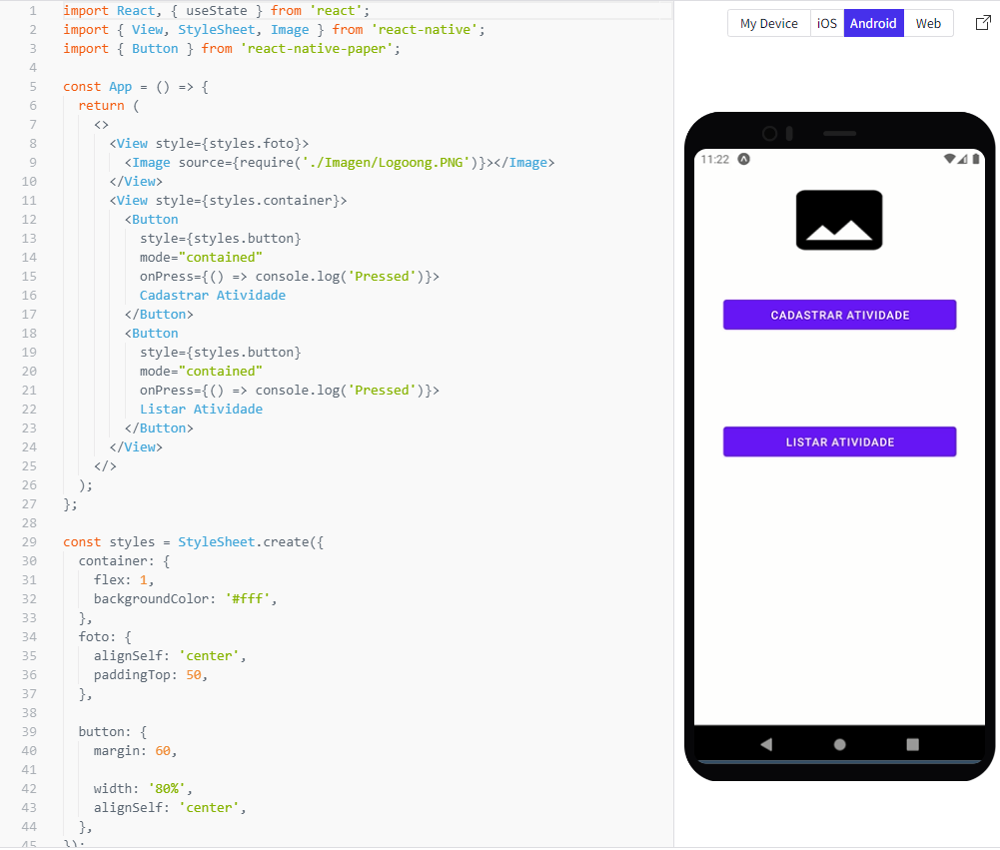
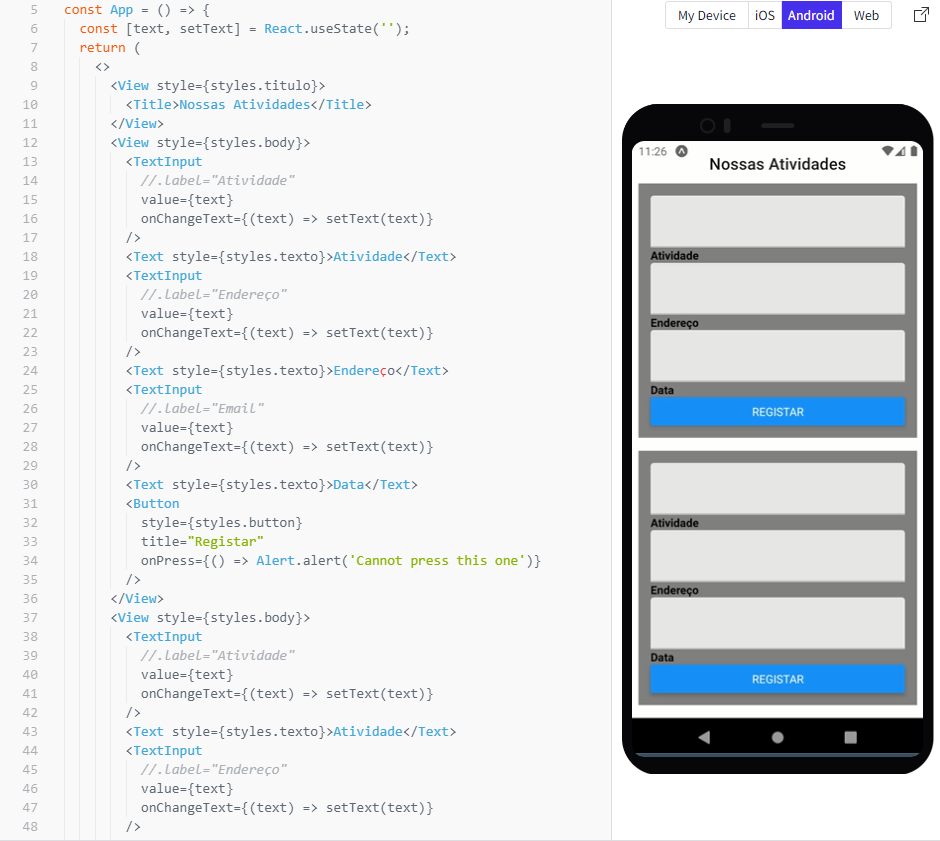
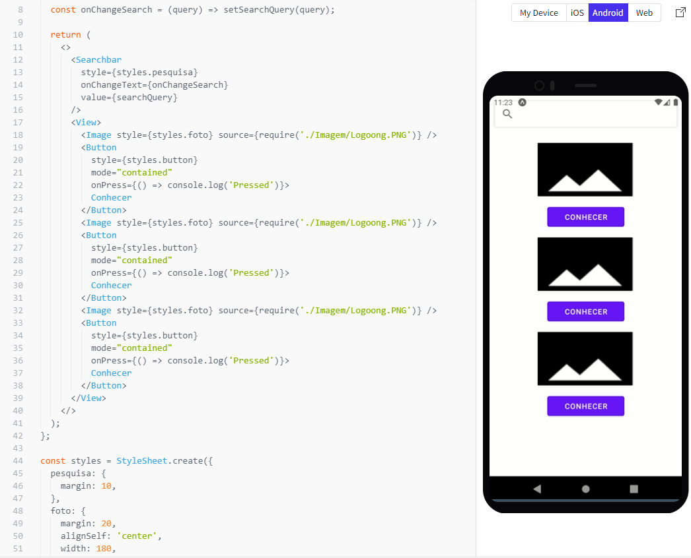

# Programação de Funcionalidades

Nesta seção é apresentada as telas da Aplicação e as funcionalidades do sistema conforme os requisitos funcionais e/ou não funcionais. Projeto ainda em fase de desenvolvimento.

## Tela – Login Ong 

A tela de login da ONG tem como objetivo validar o usuário, possibilitando-o também recuperar a senha e caso não tenha cadastro se cadastrar. Após login ela leva o usuário para a tela inicial da Ong. Para a estrutura de dados foi utilizado o React Native e JSON. Atendendo o Requisito Funcional 02.

Pode-se observar como evidência dessa funcionalidade o print em Registro de testes (RT1), bem como o a autenticação no do Login. Na Branch develop e database você encontrará os códigos referente a essa funcionalidade.

## Tela - Cadastro Ong

A tela de castrado da ONG tem como objetivo cadastrar a Ong. Para a estrutura de dados foi utilizado o React Native e JSON. Atendendo o Requisito Funcional 01.

Pode-se observar como evidência dessa funcionalidade o print em Registro de testes (RT2), bem como o utilização do CRUD solicitado para implementação. Na Branch develop e database você encontrará os códigos referente a essa funcionalidade.

## Tela – Inicial da Ong 

Está tela permite ao usuário listar as atividades da ong e também cadastrar uma atividade. Conforme fluxograma o botão voltar irá retornar para a página anterior a esta. Para a estrutura de dados foi utilizado o React Native e JSON. Atendendo o Requisito Funcional 04.

## Tela – Cadastro de Atividades 

Na tela cadastro de atividades o usuário tipo Ong poderá cadastrar uma atividade. Conforme fluxograma o botão voltar irá retornar para a página anterior a esta. Para a estrutura de dados foi utilizado o React Native e JSON. Atendendo o Requisito Funcional 03.

## Tela – Tela de Ongs 

Nesta Tela de Ongs o usuário terá a possibilidade de visualizar uma lista de ong e poder conhecer mais sobre elas e possivelmente encontrar uma ong por nome. Conforme fluxograma o botão voltar irá retornar para a página anterior a esta. Para a estrutura de dados foi utilizado o React Native e JSON. Atendendo o Requisito Funcional 05.

## Tela – Lista de atividades da Ong 

Nesta Tela de lista de atividades da Ong o usuário terá a possibilidade de visualizar as atividades das ongs e se registar em alguma atividade, não há restrição na quantidade de atividades que o usuário pode se registrar. Ao clicar em se registrar ele será direcionado para o aplicativo de WhatsApp, do qual poderá entrar em contato com a ONG. Conforme fluxograma o botão voltar irá retornar para a página anterior a esta. Para a estrutura de dados foi utilizado o React Native e JSON. Atendendo o Requisito Funcional 06.

