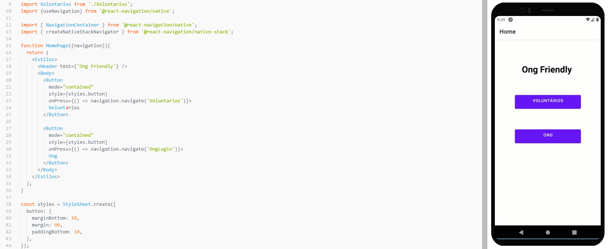
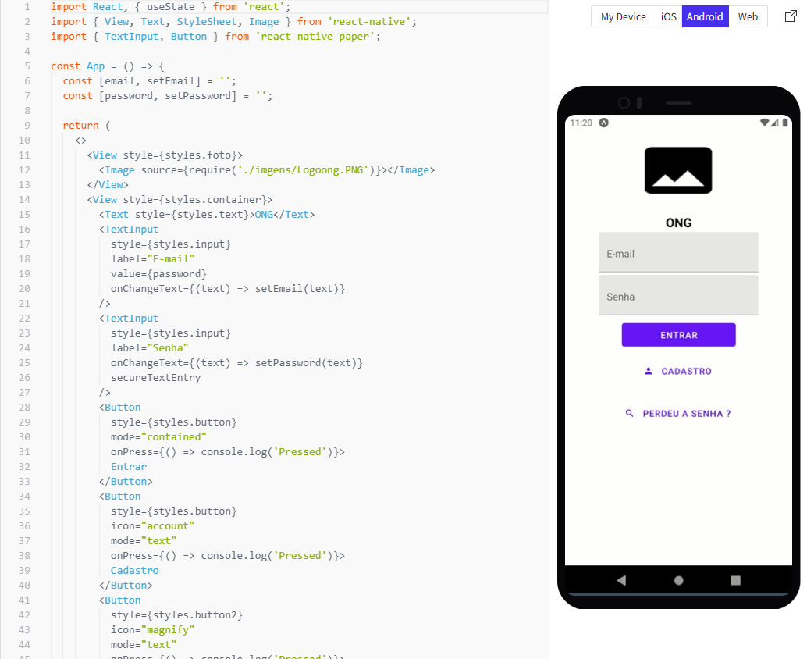
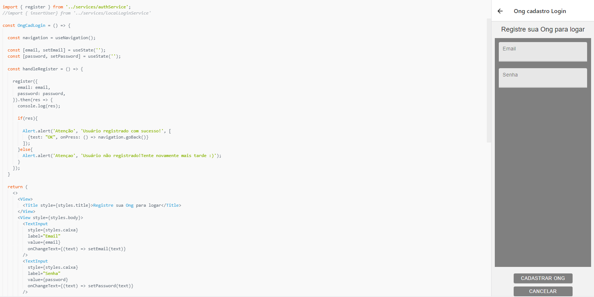
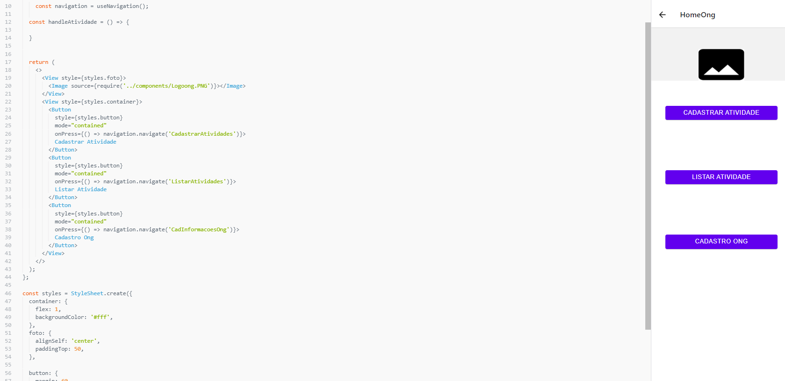
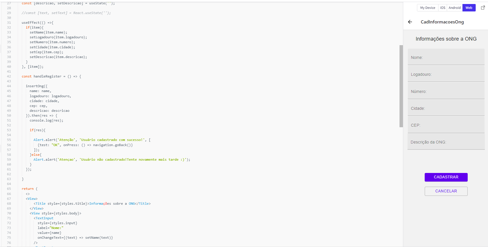
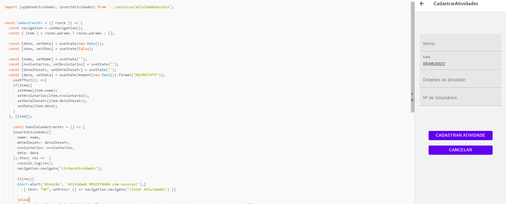
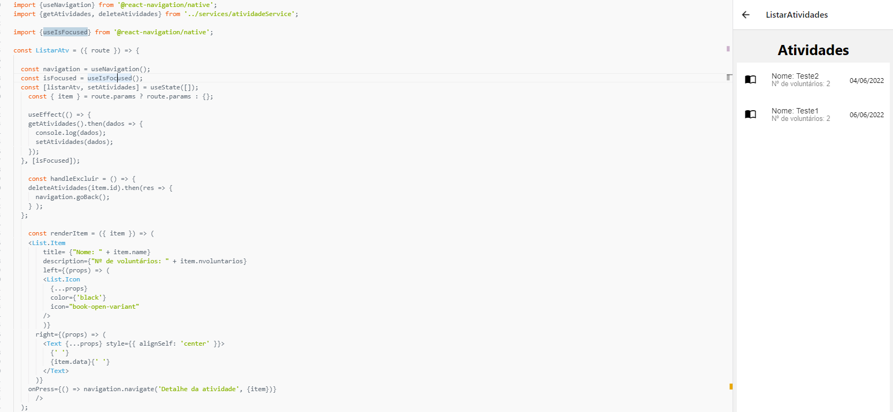
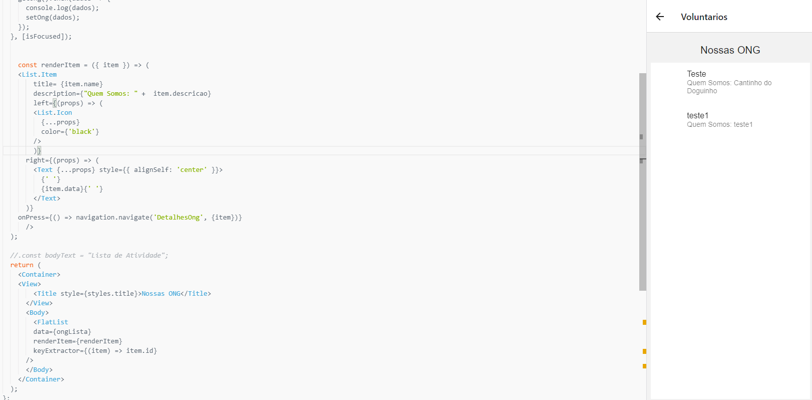
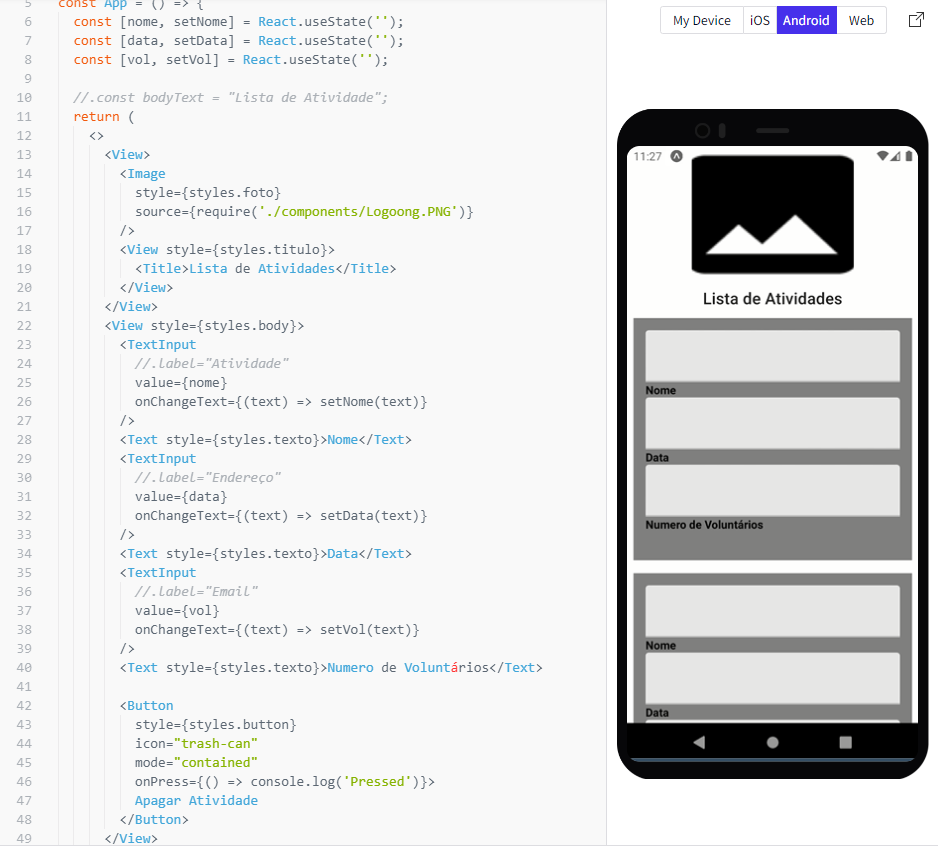

# Programação de Funcionalidades

Nesta seção é apresentada as telas da Aplicação e as funcionalidades do sistema conforme os requisitos funcionais e/ou não funcionais. Projeto ainda em fase de desenvolvimento.

## Tela – Home-Page

A tela home-page defina que tipo de usuário está utilizando o aplicativo, a partir desta dela você poderá seguir dois caminhos distintos: o do volúntário e o das Ongs.Para a estrutura de dados foi utilizado o React Native e JSON.

## Tela – Login Ong 

A tela de login da ONG tem como objetivo validar o usuário, possibilitando-o também recuperar a senha e caso não tenha cadastro se cadastrar. Após login ela leva o usuário para a tela inicial da Ong. Para a estrutura de dados foi utilizado o React Native e JSON. Atendendo o Requisito Funcional 02.

## Tela – Cadastro ONG Login 

A tela de cadastro de login da ONG tem como objetivo cadastras o usuário(ONG), permitindo o mesmo a realizar o login na tela de Login Ong. Para a estrutura de dados foi utilizado o React Native e JSON. Atendendo o Requisito Funcional 02.

## Tela – Inicial da Ong 

Está tela permite ao usuário logado listar as atividades da ong, cadastrar uma atividade e cadastrar as informações da ONG. Conforme fluxograma o botão voltar irá retornar para a página anterior a esta. Para a estrutura de dados foi utilizado o React Native e JSON. Atendendo o Requisito Funcional 04.

## Tela - Cadastro Ong

A tela de castrado da ONG tem como objetivo cadastrar as informações da Ong. Para a estrutura de dados foi utilizado o React Native e JSON. Atendendo o Requisito Funcional 01.

## Tela – Cadastro de Atividades 

Na tela cadastro de atividades o usuário tipo Ong poderá cadastrar uma atividade. Conforme fluxograma o botão voltar irá retornar para a página anterior a esta. Para a estrutura de dados foi utilizado o React Native e JSON. Atendendo o Requisito Funcional 03.

## Tela – Lista de atividades da Ong 

Nesta Tela de lista de atividades da Ong o usuário(ONG) terá a possibilidade de visualizar as atividades das ongs, ao clicar em uma atividade da lista o usuario poderá atualizar ou deletar a atividade cadastrada. Conforme fluxograma o botão voltar irá retornar para a página anterior a esta. Para a estrutura de dados foi utilizado o React Native e JSON. Atendendo o Requisito Funcional 06.

## Tela – Tela de Lista de Ongs 

Nesta Tela o usuário interessado em se voluntariar terá acesso a uma lista de Ongs e poderá conhecer mais sobre elas e possivelmente encontrar uma ong por nome. Conforme fluxograma o botão voltar irá retornar para a página anterior a esta. Para a estrutura de dados foi utilizado o React Native e JSON. Atendendo o Requisito Funcional 05.

## Tela – Detalhe da Ong 
Ao clicar em uma Ong o usuário poderá ver os detalhes da mesma caso queria poderá seguir adiante vendo as atividades desta ONG. Conforme fluxograma o botão voltar irá retornar para a página anterior a esta. Para a estrutura de dados foi utilizado o React Native e JSON. Atendendo o Requisito Funcional 06.

## Tela – Lista de atividades da Ong 
Após o interesse do usu´pario na ONG o mesmo poderá ver as atividades cadastrada da mesma e se registar em alguma atividade, não há restrição na quantidade de atividades que o usuário pode se registrar. Ao clicar em se registrar ele será direcionado para o aplicativo de WhatsApp, do qual poderá entrar em contato com a ONG. Conforme fluxograma o botão voltar irá retornar para a página anterior a esta. Para a estrutura de dados foi utilizado o React Native e JSON. Atendendo o Requisito Funcional 06.

