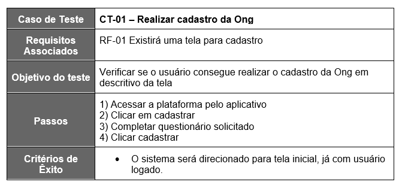
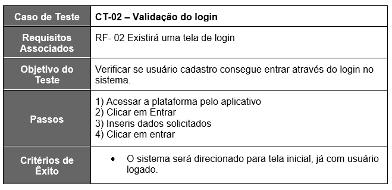
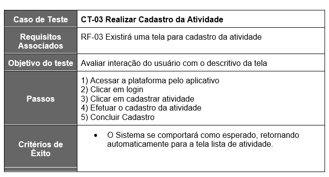
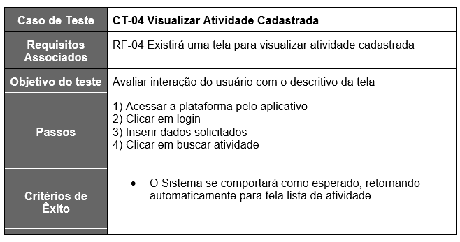
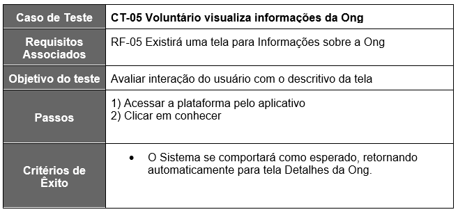
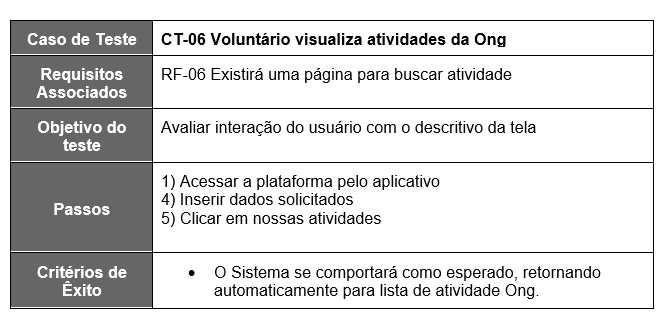

# Plano de Testes de Software

Requisitos para realização dos testes de software são:

  - Aplicativo publicado
  -  Disponível nos sistemas IOS e Android
  - Conectividade de Internet para acesso às plataformas (API'S)

Os testes funcionais a serem realizados no aplicativo são descritos a seguir.

