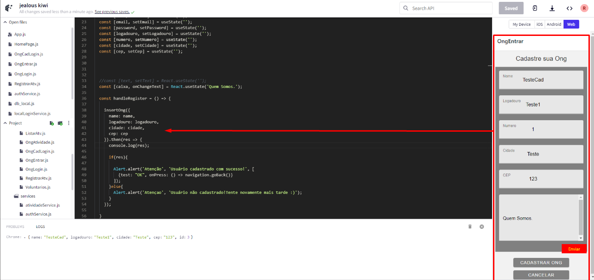
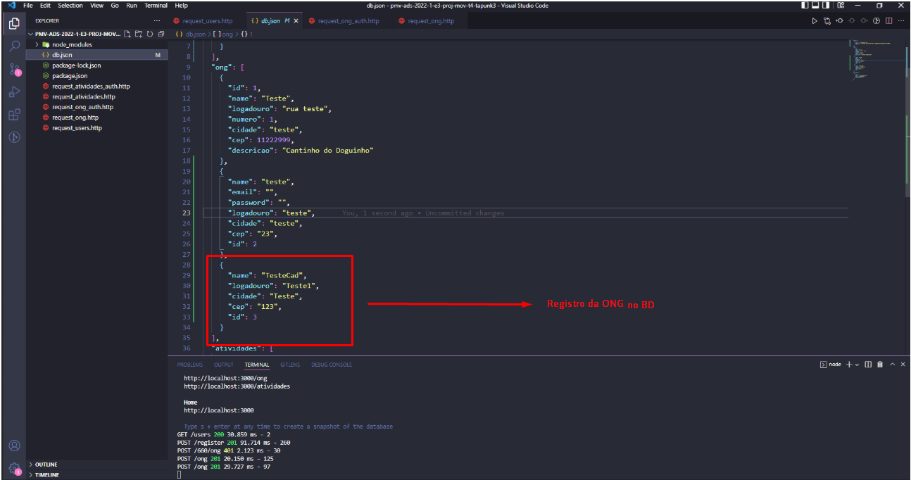
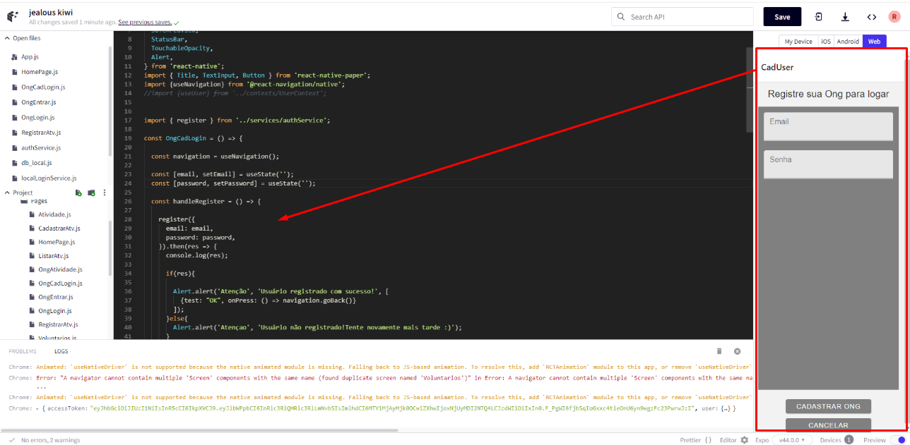
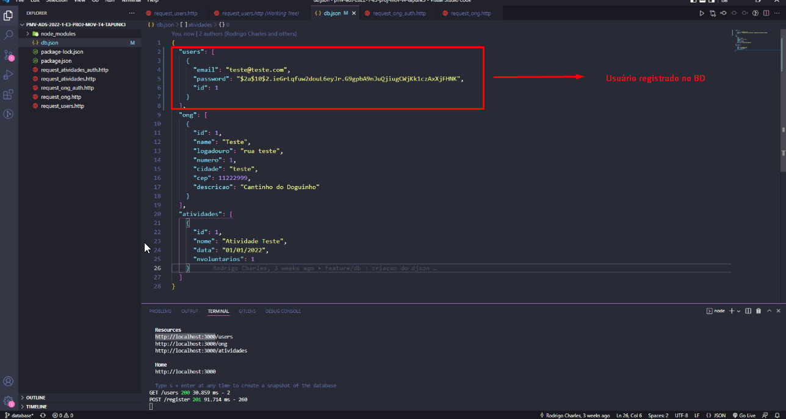
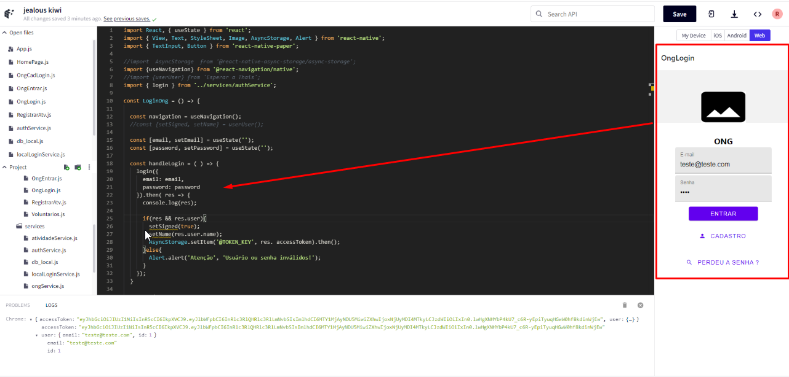

# Registro de Testes de Software

Os resultados obtidos nos testes de Software estão descritos a seguir.

|     Evidências  RT1      |                                                             |
|--------------------------|-------------------------------------------------------------------------------------------|
|                          |     

|     Evidências  RT2      |     
|--------------------------|-------------------------------------------------------------------------------------------|
|                          |     
|                          |   
